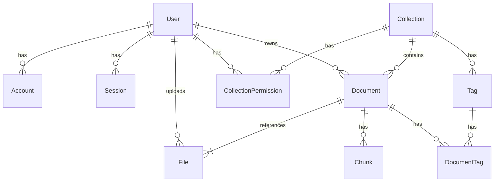
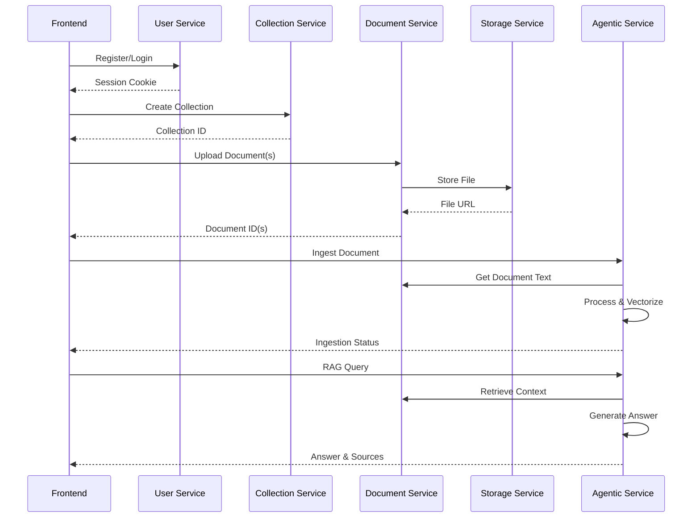

# System Architecture

This document provides a high-level overview of the system architecture, including the database schema and backend services.

## Technology Stack

- **Backend**: Python, FastAPI, SQLAlchemy, PostgreSQL (with pgvector)
- **Frontend**: TypeScript, Next.js, React, Tailwind CSS
- **Database**: PostgreSQL
- **Vector Store**: pgvector

## Database Schema

The database is designed to support a document management and knowledge extraction system. The core entities are `User`, `Collection`, `Document`, and `File`.

### Entity Relationship Diagram (ERD)

### Database Best Practices

- **Migrations**: All schema changes must be managed through Alembic migrations. Do not make manual changes to the database schema.
- **Cascading Deletes**: Use cascading deletes (`ondelete="CASCADE"`) for tightly coupled entities (e.g., `Document` and its `Chunks`).
- **Indexing**: Add indexes to foreign keys and frequently queried columns.
- **Data Validation**: Use SQLAlchemy's validation features to ensure data integrity.
- **Enums**: Use `Enum` types for columns with a fixed set of values.

## Backend Services

The backend is divided into several services, each with a specific set of responsibilities.

- **User Service (`/auth`)**: Handles user registration, login, logout, and session management. It is responsible for authenticating users and managing their accounts.

- **Collection Service (`/collections`)**: Manages collections of documents, including creation, retrieval, updates, and deletion. It also handles permissions, allowing users to share collections with others.

- **Document Service (`/documents`)**: Responsible for all document-related operations, such as uploading, updating, and deleting documents. It also manages document tagging.

- **Storage Service (`/storage`)**: Provides an abstraction layer for file storage. It handles the uploading, retrieval, and deletion of files from the underlying storage system (e.g., Minio).

- **Agentic Service (`/agentic`)**: This is the core of the RAG and knowledge extraction functionality. It exposes endpoints for:
  - Ingesting and processing documents.
  - Extracting knowledge graphs from documents.
  - Clustering documents by topic.
  - Querying the RAG agent to get answers from the knowledge base.

### Service Interaction Diagram

